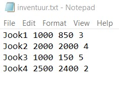

# Filip Taik LINQ näidisrakendus

Rakendus arvutab baari-inventuuri andmete järgi kui palju on mingit jooki puudu ja kui palju maksab puuduoleva kauba tellimine.

Kõigepealt saab rakendus sisse faili inventuur.txt
