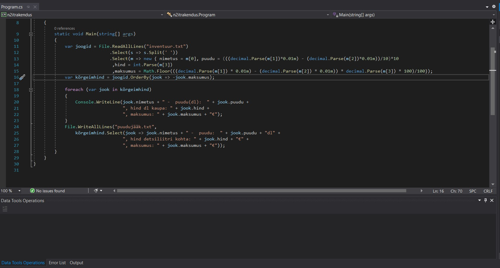
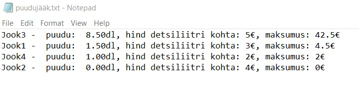

# Filip Taik LINQ näidisrakendus

Rakendus arvutab baari-inventuuri andmete järgi kui palju on mingit jooki puudu ja kui palju maksab puuduoleva kauba tellimine.

Kõigepealt saab rakendus sisse faili inventuur.txt

Esimesena on märgitud joogi nimi, seejärel milliliitrites kogus mis peaks olema, tegelik kogus ja toote hinf detsiliitri kohta.

Seejärel jagab programm stringi laiali, teeb kogused detsiliitriteks ja arvutab kui palju on puudu ja kui palju peab uue koguse eest maksma.

Lõpptulemusena kirjutatakse uus fail, kus joogid on järjestatud kõige suurema puudujäägi kaupa. Märgitud on kui palju on puudu, kui palju maksab 1 detsiliiter ja kui suur on kogusumma.

